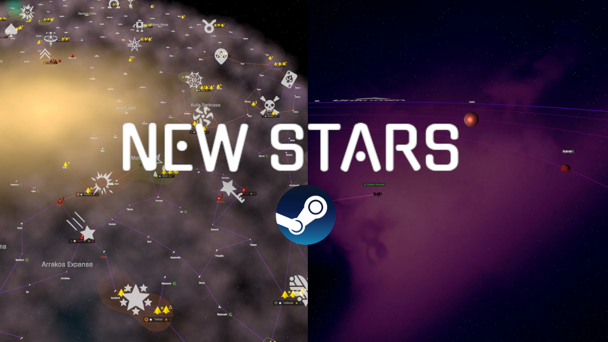
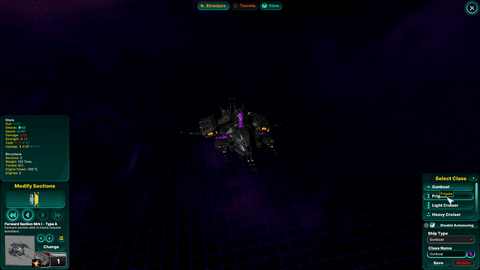
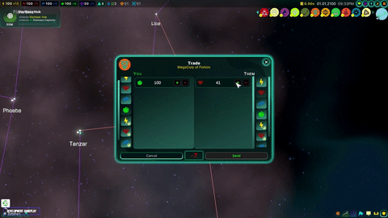
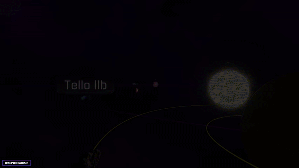

<!--📏LINE-->

## Unity game developer and full-stack web developer.

<!--🦜PARROTSEMOJI / 🌐WEBSITE: https://github.com/seanprashad/slackmoji/ -->

  

  
## Here is the current project I am working on
   
  

 
 

  <!--📏LINE-->

